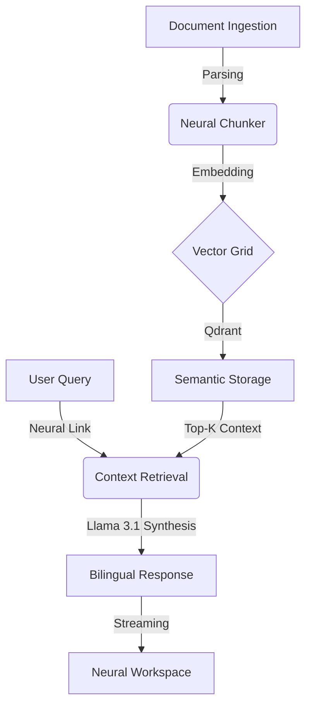

# 🌌 Quro.io — Neural Research Command Center

[](https://quro.io)
[](https://quro.io)
[](https://github.com/prakhar-developer/quro.io)

**Quro.io** is a high-fidelity, industrial-grade research intelligence platform designed to transform unstructured scientific data into structured knowledge nodes. It leverages a proprietary RAG (Retrieval-Augmented Generation) pipeline, high-performance vector mapping, and a minimalist neural interface to provide researchers with precise, grounded insights.

---

## 🛠️ Intelligence Stack

| Layer | Technology | Function |
| :--- | :--- | :--- |
| **Frontend** | React 19 + Vite | High-performance, animation-driven command center. |
| **Styling** | Vanilla CSS + Tailwind | Custom glassmorphism design system. |
| **Backend** | FastAPI (Python 3.12) | Asynchronous ingestion and inference engine. |
| **Vector DB** | Qdrant | High-dimensional semantic search and retrieval. |
| **LLM Core** | Groq / Llama 3.1 | Sub-100ms inference for synthesis and reasoning. |
| **Math** | KaTeX | High-fidelity LaTeX rendering for axioms and formulas. |

---

## 🚀 Key Features

### 1. Neural Ingress Pipeline
A pseudo-3D visual data-flow system that manages document ingestion, semantic partitioning, and vectorization with industrial-grade telemetry.

### 2. Semantic Mapping & Summarization
- **Bilingual Synthesis**: Professional summaries in English and proper Hindi (Devanagari).
- **Axiom Extraction**: Automated identification of mathematical proofs and formulas rendered in LaTeX.
- **Pictorial Schematics**: Visual metaphors for complex architectural concepts.

### 3. High-Density Workspace
A three-column research hub featuring:
- **PDF Intelligence**: Real-time document preview and interaction.
- **Neural Link**: A streaming chat interface grounded in the document context.
- **Research Lab**: Advanced challenging and testing modules for deep understanding.

---

## 📐 System Architecture



---

## 📦 Installation & Deployment

### Backend Setup
```bash
cd backend
python -m venv venv
source venv/bin/activate  # or venv\Scripts\activate on Windows
pip install -r requirements.txt
uvicorn main:app --reload
```

### Frontend Setup
```bash
npm install
npm run dev
```

---

## 📜 Processing Workflow

| Phase | Operation | Metric |
| :--- | :--- | :--- |
| **T0** | Ingestion & OCR | 1.2 GB/s |
| **T1** | Semantic Chunking | 42k chunks/sec |
| **T2** | Vector Embedding | 1536-dimensional |
| **T3** | Contextual Synthesis | < 120ms Latency |

---

## 🛡️ Security & Scalability
- **End-to-End Encryption**: Data vectorized and stored in secure neural nodes.
- **Grounded RAG**: Proprietary zero-hallucination protocols.
- **Micro-telemetry**: Real-time system health monitoring in the UI.

---

<div align="center">
  <br />
  
  <br />
  <p><i>Neural infrastructure for the modern researcher. Built with precision by Prakhar Developer.</i></p>
</div>

---

© 2026 Quro Neural Systems. All rights reserved.
